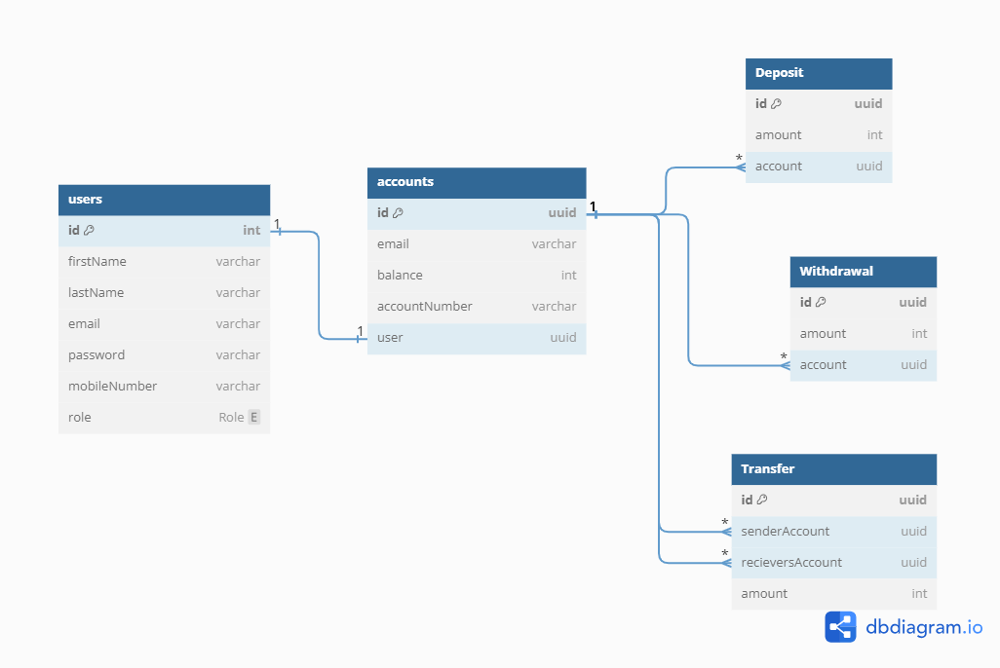

## learnlyapp-backend-dev-assignment

## Task Description

Develop a portion of a financial system backend that manages transactions for a banking application. The system should be built using Nest.js, with MongoDB as the database and Docker for containerization. The solution should adhere to best practices in software development, including modularity, scalability, and security.

## Requirements

- [Nodejs](https://nodejs.org/en/) is a JavaScript runtime built on Chrome's V8 JavaScript engine.
- [Mongodb](https://www.mongodb.com/) is a source-available cross-platform document-oriented database program. Classified as a NoSQL database program, MongoDB uses JSON-like documents with optional schemas
- [Docker](https://www.docker.com/) is a software platform that allows you to build, test, and deploy applications quickly using containers.

## Database Design

## How to Run

- Clone the repository by running `git clone https://github.com/alahirajeffrey/learnlyapp-backend-dev-assignment.git`

### With Docker

- Open a terminal and navigate to the project directory.
- Create a `.env` file at the root of the project and populate using the `.env.example` file.
- Run the command `docker build -t learnlyapp-backend-dev-assignment .` to build the image.
- The command will build the Docker image with the tag learnlyapp-backend-dev-assignment-app using the current directory as the build context.
- Once the image is built, run the command `docker run --rm -p 3001:3001 learnlyapp-backend-dev-assignment`.
- This will start a container from the image and map port 3001 of the container to port 3001 on your local machine.
- Open your browser and navigate to `http://localhost:3001/api-doc` to open the swagger documentation.

### Without Docker

- Open a terminal and navigate to the project directory.
- Create a `.env` file at the root of the project and populate using the `.env.example` file.
- Run `npm install` to install dependencies.
- Run `npm run build` to build the application.
- Run `npm run start:prod` to run the application.
- Open your browser and navigate to `http://localhost:3001/api-doc` to open the swagger documentation.

## Todo

- Add logging
- Write tests for auth services and controllers
- Write tests for account services and controllers
- Write tests for transactions services and controllers
- Complete documentation
